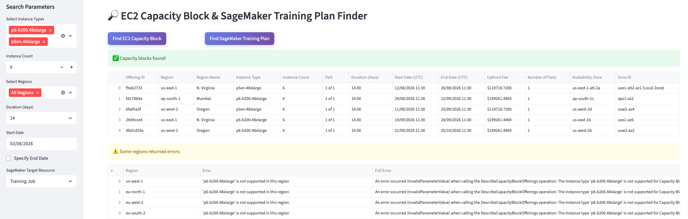

# AWS EC2 Capacity Blocks and SageMaker Training Plans Finder

🔎 Find short-term GPU reservations on AWS using [EC2 Capacity Blocks](https://aws.amazon.com/ec2/capacityblocks/) and [SageMaker Training Plans](https://docs.aws.amazon.com/sagemaker/latest/dg/reserve-capacity-with-training-plans.html) across regions and instance types.



[](https://opensource.org/licenses/MIT)
[](https://strandsagents.com)
[](https://streamlit.io)
[](https://www.python.org/)

## Two Ways to Use

### 🤖 AI Agent (Strands Agents SDK + Skills)

An interactive AI agent that uses [Agent Skills](https://agentskills.io) for progressive disclosure and a `user_input` tool for conversational parameter gathering.

```bash
pip install -r requirements-agent.txt
python agent.py
```

The agent will:
1. Ask what GPU capacity you need (instance type, count, duration)
2. Search across all AWS regions in parallel
3. Present results sorted by price
4. Suggest alternatives if nothing is found

**Optional**: Install [AgentSkills](https://github.com/aws-samples/sample-strands-agents-agentskills) for the progressive disclosure skill loading pattern:
```bash
pip install agentskills
```

### 📊 Streamlit App (Original)

A visual dashboard for exploring capacity offerings with filters and data tables.

```bash
pip install -r requirements.txt
streamlit run app.py
```

Or run directly with `uvx`:
```bash
uvx --with boto3==1.40.18 --with pandas==2.3.2 --from streamlit==1.49.0 streamlit run https://raw.githubusercontent.com/aws-samples/sample-capacity-finder-for-ec2-capacity-block-and-sagemaker-training-plan/main/app.py
```

## Architecture

### Agent Approach

```
User ──→ Strands Agent ──→ user_input tool (gather requirements)
                       ──→ search_ec2_capacity_blocks tool (parallel region scan)
                       ──→ search_sagemaker_training_plans tool (parallel region scan)
                       ──→ Agent Skills (SKILL.md progressive disclosure)
```

The agent uses:
- **Custom `@tool` functions** that wrap the AWS APIs (`ec2:DescribeCapacityBlockOfferings`, `sagemaker:SearchTrainingPlanOfferings`)
- **Agent Skills** ([AgentSkills.io](https://agentskills.io) standard) for encoding domain knowledge about GPU capacity
- **`user_input` tool** for interactive clarification — the agent asks follow-up questions before searching

### Skills Structure

```
skills/
└── capacity-finder/
    └── SKILL.md          # Domain knowledge, supported instances, workflow
```

The SKILL.md follows the [AgentSkills.io specification](https://agentskills.io/specification):
- YAML frontmatter with `name`, `description`, and `allowed-tools`
- Markdown body with instructions, supported instance types, and best practices
- Progressive disclosure: metadata loaded at startup (~100 tokens), full instructions loaded only when the skill is activated

## Prerequisites

- Python 3.13+
- AWS credentials configured (`aws configure` or environment variables)
- Required IAM permissions:
  - `ec2:DescribeCapacityBlockOfferings`
  - `sagemaker:SearchTrainingPlanOfferings`

### Minimal IAM Policy

```json
{
  "Version": "2012-10-17",
  "Statement": [
    {
      "Effect": "Allow",
      "Action": [
        "ec2:DescribeCapacityBlockOfferings",
        "sagemaker:SearchTrainingPlanOfferings"
      ],
      "Resource": "*"
    }
  ]
}
```

## Supported Instance Types

| Instance Type | GPU | Memory | Use Case |
|---|---|---|---|
| p6-b200.48xlarge | 8x NVIDIA B200 | 1.4 TB | Latest gen training |
| p6-b300.48xlarge | 8x NVIDIA B300 | 1.4 TB | Latest gen training |
| p5.48xlarge | 8x NVIDIA H100 | 640 GB | Large-scale training |
| p5e.48xlarge | 8x NVIDIA H100 | 640 GB | Enhanced networking |
| p4d.24xlarge | 8x NVIDIA A100 | 320 GB | Training & inference |
| trn1.32xlarge | 16x Trainium | 512 GB | Cost-effective training |
| trn2.48xlarge | 16x Trainium2 | 512 GB | Next-gen Trainium |

## Supported Regions

us-east-1, us-east-2, us-west-1, us-west-2, eu-north-1, eu-west-2, ap-northeast-1, ap-northeast-2, ap-south-1, ap-southeast-2, ap-southeast-3, ap-southeast-4, sa-east-1

## License

MIT
