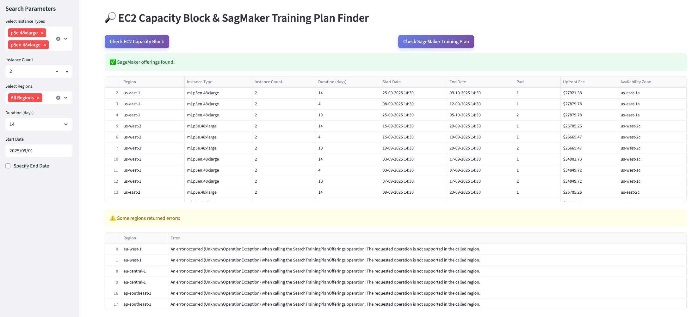

# AWS EC2 Capacity Blocks and SageMaker Training Plans Finder

🔎 A Streamlit app for exploring available AWS [EC2 Capacity Blocks](https://aws.amazon.com/ec2/capacityblocks/) and [SageMaker Training Plans](https://docs.aws.amazon.com/sagemaker/latest/dg/reserve-capacity-with-training-plans.html) across regions and instance types.




[](https://opensource.org/licenses/MIT)
[](https://streamlit.io)
[](https://www.python.org/)

## Very Quick Start

This is a single-file Streamlit app. Download `app.py` and run:
```bash
   streamlit run app.py
```
Make sure you have:
- Python Dependencies (listed in [requirements.txt](requirements.txt)):  `streamlit`, `boto3`, `pandas`
- AWS IAM permissions: `ec2:DescribeCapacityBlockOfferings`, `sagemaker:SearchTrainingPlanOfferings`

## Quick Start

1. **Clone the repository**
   ```bash
   git clone <sample-capacity-finder-for-ec2-capacity-block-and-sagemaker-training-plan repo URL>
   cd sample-capacity-finder-for-ec2-capacity-block-and-sagemaker-training-plan
   ```

2. **Install dependencies**
   ```bash
   pip install -r requirements.txt
   ```

3. **Configure AWS credentials**

   The app requires the following AWS IAM permissions:
   - `ec2:DescribeCapacityBlockOfferings`
   - `sagemaker:SearchTrainingPlanOfferings`

   ```bash
   aws configure

   # or set environment variables
   export AWS_ACCESS_KEY_ID=your_key
   export AWS_SECRET_ACCESS_KEY=your_secret
   ```

4. **Run the application**
   ```bash
   streamlit run app.py
   ```

## Additional
- (Optional) Create and activate a virtual environment:
```
python -m venv venv
source venv/bin/activate
```
- Example of a minimal IAM policy:
```
{
  "Version": "2012-10-17",
  "Statement": [
    {
      "Effect": "Allow",
      "Action": [
        "ec2:DescribeCapacityBlockOfferings",
        "sagemaker:SearchTrainingPlanOfferings"
      ],
      "Resource": "*"
    }
  ]
}
```

## License

This project is licensed under the [MIT License](https://opensource.org/licenses/MIT).


## Contributing

See [CONTRIBUTING](CONTRIBUTING.md#security-issue-notifications) for more information.